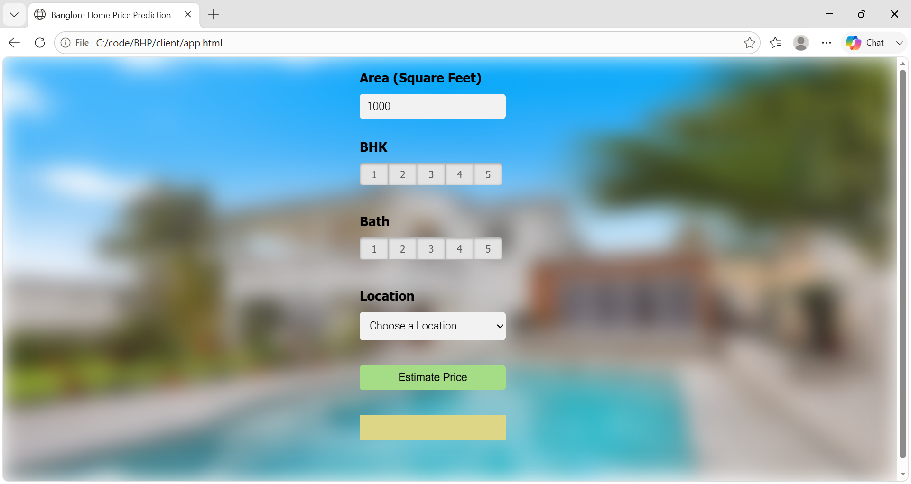
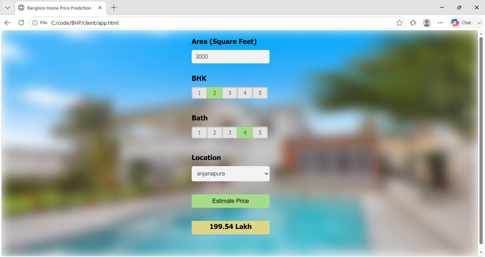

# 🏠 Bengaluru House Price Prediction

## Project Overview

This project was completed as part of my **Artificial Intelligence course (4th Semester)**. It is an end-to-end machine learning application that predicts residential property prices in Bengaluru using features such as location, total area (sq. ft), BHK, and number of bathrooms.

The project covers the complete machine learning pipeline, including data preprocessing, feature engineering, outlier removal, model training using Linear Regression, Flask API development, frontend integration with HTML/CSS/JavaScript, and deployment on AWS using Nginx.

This project provided practical experience in building and deploying a machine learning application while strengthening my understanding of the end-to-end ML development process.

## Features

* Data cleaning and preprocessing
* Feature engineering
* Outlier detection and removal
* House price prediction using Linear Regression
* Flask REST API
* Interactive web interface
* AWS deployment

## Technologies Used

* Python
* Pandas
* NumPy
* Scikit-Learn
* Flask
* HTML
* CSS
* JavaScript
* AWS
* Nginx

## Dataset

**Dataset:** Bengaluru House Price Dataset

**Input Features**

* Location
* Total Square Feet
* BHK
* Bathrooms

**Output**

* Predicted House Price

## Project Workflow

* Data preprocessing
* Feature engineering
* Outlier removal
* Model training using Linear Regression
* Model evaluation
* Flask API development
* Frontend integration
* AWS deployment

## Project Screenshots

### Home Page

### Prediction Result

## Acknowledgement

This project was developed as part of my Machine Learning learning journey by following the **Codebasics** YouTube tutorial:

**Machine Learning & Data Science Project - 1: Introduction (Real Estate Price Prediction Project)**

The tutorial provided valuable guidance for understanding the complete machine learning workflow, from data preprocessing to deployment.
